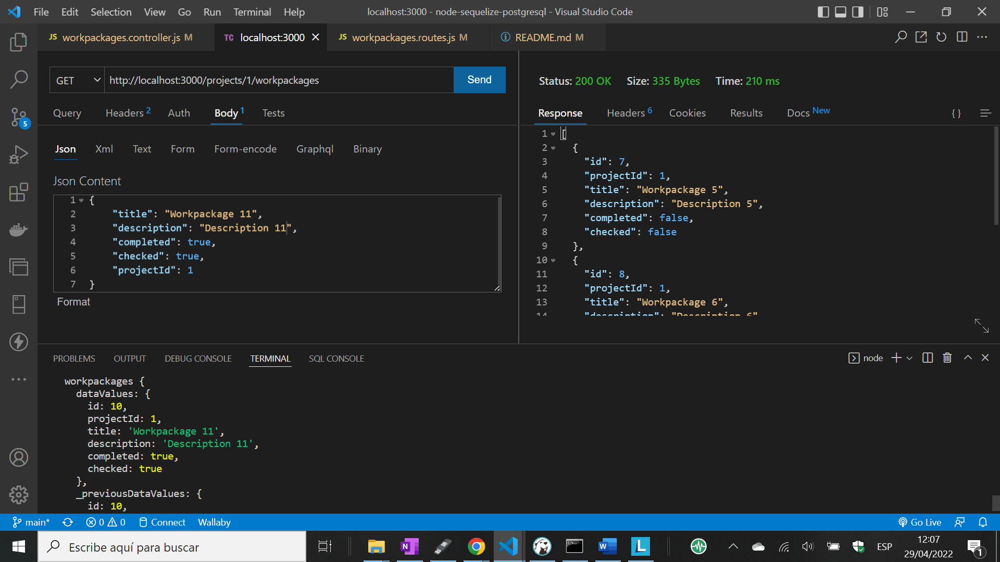

# :zap: Node Sequelize PostgreSQL

* Node.js + Express used with Sequelize Object-Relational Mapping (ORM) to perform promise-based Create, Read, Update & Delete (CRUD) operations on linked data tables in a PostgreSQL database
* **Note:** to open web links in a new window use: _ctrl+click on link_


## :page_facing_up: Table of contents

* [:zap: Node Sequelize PostgreSQL](#zap-node-sequelize-postgresql)
  * [:page_facing_up: Table of contents](#page_facing_up-table-of-contents)
  * [:books: General info](#books-general-info)
  * [:camera: Screenshots](#camera-screenshots)
  * [:signal_strength: Technologies](#signal_strength-technologies)
  * [:floppy_disk: Setup](#floppy_disk-setup)
  * [:wrench: Testing](#wrench-testing)
  * [:computer: Code Examples](#computer-code-examples)
  * [:cool: Features](#cool-features)
  * [:clipboard: Status & To-Do List](#clipboard-status--to-do-list)
  * [:clap: Inspiration](#clap-inspiration)
  * [:file_folder: License](#file_folder-license)
  * [:envelope: Contact](#envelope-contact)

## :books: General info

* SQL database data based on Sequelize Project and Workpackage models
* Node.js project structure best practises observed with separate routes & controller code
* The use of Projects and Workpackages is based on my Engineering experience in Norway where all Maintenance and Modification projects are documented in engineering workpackages that all have a unique workpackage id number and are tied to a project using the project id number

* Project Structure:

```bash
├── package.json
└── src
  ├── app.js
  ├── controllers
  │  ├── projects.controller.js
  │  └── workpackages.controller.js
  ├── db
  │  └── database.js
  ├── index.js
  ├── models
  │  ├── Project.js
  │  └── Workpackage.js
  └── routes
    ├── projects.routes.js
    └── workpackages.routes.js
```

* Database Overview:


## :camera: Screenshots



## :signal_strength: Technologies

* [Node.js v16](https://nodejs.org/) Javascript runtime using the [Chrome V8 engine](https://v8.dev/)
* [Express v4](https://www.npmjs.com/package/express) web framework for node
* [Sequelize v6](https://sequelize.org/) TypeScript and Node.js Object-relational mapping (ORM) for Postgres
* [Thunder Client](https://www.thunderclient.com/) lightweight REST Client used to test CRUD operations
* [DBeaver relational database tool](https://dbeaver.com/) used to connect to a PostgreSQL database
* [DB Diagram](https://dbdiagram.io/) used to create the database overview drawing
* [morgan v1](https://www.npmjs.com/package/morgan) HTTP request logger middleware for node.js

## :floppy_disk: Setup

* Assuming you have PostgreSQL database installed, install DBeaver and connect to your PostgreSQL database using DBeaver
* `npm i` to install dependencies
* Create `.env` and add database credentials - see `.env.example`
* `npm run dev` runs app in the development mode with auto-restart.
* Open [http://localhost:3000/projects](http://localhost:3000/projects) to see projects list in browser
* Open [http://localhost:3000/workpackages](http://localhost:3000/workpackages) to see workpackages list in browser
* CRUD operations can be performed using the Thunder Client VS Code extension
* PostgreSQL console can be used to work with database: `\c projects` to connect to projects database, `\dt` to list tables, `SELECT * FROM projects;` to see projects table

## :wrench: Testing

* All CRUD functions tested using Thunder Client

## :computer: Code Examples

* `models/Workpackage.js` Workpackage model using Sequelize.define

```javascript
export const Workpackage = sequelize.define(
  "workpackages",
  {
    id: {
      type: DataTypes.INTEGER,
      primaryKey: true,
      autoIncrement: true,
    },
    title: {
      type: DataTypes.STRING,
    },
    description: {
      type: DataTypes.STRING,
    },
    completed: {
      type: DataTypes.BOOLEAN,
      defaultValue: false,
    },
    checked: {
      type: DataTypes.BOOLEAN,
      defaultValue: false,
    },
  },
  {
    timestamps: false,
  }
);
```

## :cool: Features

* Sequelize is easy to learn and the database synchronisation function is useful

## :clipboard: Status & To-Do List

* Status: Working
* To-Do: Optional: add frontend cards or table to display data - could use EJS

## :clap: Inspiration

* [Sequelize documentation: Model Basics](https://sequelize.org/docs/v6/core-concepts/model-basics/)
* [Sequelize documentation: Model Querying finders](https://sequelize.org/docs/v6/core-concepts/model-querying-finders/)

## :file_folder: License

* This project is licensed under the terms of the MIT license.

## :envelope: Contact

* Repo created by [ABateman](https://github.com/AndrewJBateman), email: gomezbateman@yahoo.com
